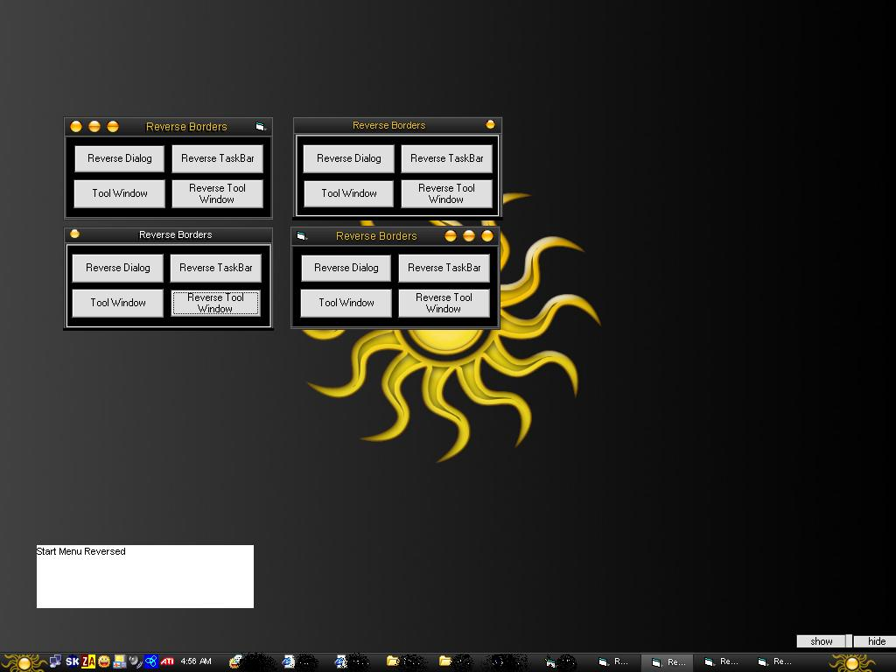



## Reverse Borders Revised

### Description

Same as my other reverse border submision but i added code to flip task bar back to standard position and make reversed dialog border standard dialog window.
 
### More Info
 
needs firm grasp on API programming!

             |
---                |---
**Submitted On**   |2005-05-03 12:45:20
**By**             |[Robert Bequette](https://github.com/Planet-Source-Code/PSCIndex/blob/master/ByAuthor/robert-bequette.md)
**Level**          |Advanced
**User Rating**    |5.0 (10 globes from 2 users)
**Compatibility**  |VB 3\.0, VB 4\.0 \(16\-bit\), VB 4\.0 \(32\-bit\), VB 5\.0, VB 6\.0
**Category**       |[Miscellaneous](https://github.com/Planet-Source-Code/PSCIndex/blob/master/ByCategory/miscellaneous__1-1.md)
**World**          |[Visual Basic](https://github.com/Planet-Source-Code/PSCIndex/blob/master/ByWorld/visual-basic.md)
**Archive File**   |[Reverse\_Bo188420532005\.zip](https://github.com/Planet-Source-Code/robert-bequette-reverse-borders-revised__1-60341/archive/master.zip)

